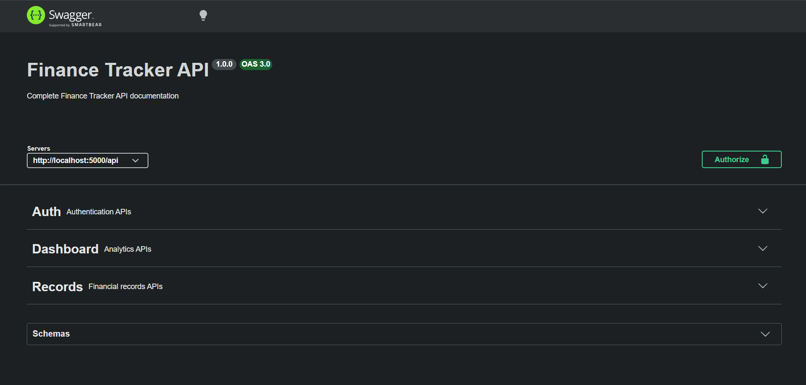
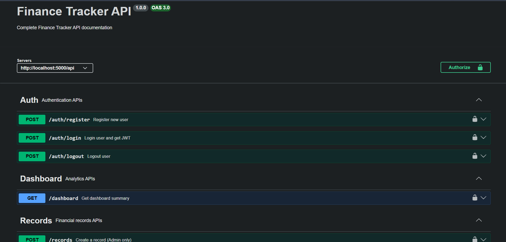

# 🚀 Finance Tracker API Backend

A scalable backend system for managing financial records with role-based access, built using Node.js, Express, and MongoDB.

---

# 📌 Features

- 🔐 JWT Authentication (Login/Register/Logout)
- 👥 Role-Based Access Control (Admin, Analyst, Viewer)
- 💰 Financial Records Management (CRUD)
- 📊 Dashboard Analytics (Income, Expense, Balance)
- 🔍 Search & Advanced Filtering
- 📄 Pagination Support
- 🗑️ Soft Delete Functionality
- ⚠️ Centralized Error Handling
- 📘 Swagger API Documentation

---

# 🏗️ Tech Stack

- Node.js
- Express.js
- MongoDB + Mongoose
- JWT Authentication
- Swagger UI

---

## ⚙️ Setup Instructions
    ```
    git clone https://github.com/Sohan-hub11/Finance-Tracker.git
    cd Finance-Tracker

### 2️⃣ Install Dependencies

    npm install

#### 3️⃣ Create .env File

Create a .env file in the root directory and add:

    MONGO_URI=your_mongodb_connection_string
    JWT_SECRET=your_secret_key
    PORT=5000
### 4️⃣ Run Server
    node server.js
### 5️⃣ Access API

Base URL:
    
    https://finance-tracker-x2d6.onrender.com

Swagger Docs:
    
    https://finance-tracker-x2d6.onrender.com/api-docs

---

## 🔐 Authentication & Roles

| Role     | Permissions |
|----------|------------|
| Viewer   | View dashboard only |
| Analyst  | View records + analytics |
| Admin    | Full access (CRUD + users) |

---

## 📡 API Endpoints

### 🔑 Auth APIs

| Method | Endpoint        | Description            |
|--------|---------------|------------------------|
| POST   | `/auth/register` | Register new user     |
| POST   | `/auth/login`    | Login & get token     |
| POST   | `/auth/logout`   | Logout user           |

---

### 💰 Records APIs

| Method | Endpoint        | Description                          |
|--------|---------------|--------------------------------------|
| POST   | `/records`     | Create record (Admin)               |
| GET    | `/records`     | Get records (Pagination + Filters)  |
| PUT    | `/records/:id` | Update record                      |
| DELETE | `/records/:id` | Soft delete record                 |

---

### 📊 Dashboard APIs

| Method | Endpoint      | Description                          |
|--------|--------------|--------------------------------------|
| GET    | `/dashboard` | Get summary (income, expense, balance) |

---

## 🔍 Query Parameters (Records API)

| Param       | Description            |
|------------|------------------------|
| page       | Page number            |
| limit      | Items per page         |
| type       | income / expense       |
| category   | Filter by category     |
| search     | Search in notes        |
| startDate  | Start date filter      |
| endDate    | End date filter        |
| minAmount  | Minimum amount         |
| maxAmount  | Maximum amount         |

---

## 🧠 Assumptions

- JWT is used for authentication (stateless)
- Logout is handled client-side (token removal)
- Users are pre-assigned roles or updated manually
- Financial data is scoped globally (not multi-tenant)

---

## ⚖️ Tradeoffs

- ❗ No refresh token system implemented (simplified authentication)
- ❗ Soft delete used instead of permanent delete for data safety
- ❗ Minimal validation (can be enhanced using Joi or similar libraries)
- ❗ No caching layer for dashboard (kept simple for clarity)

---

## 🚀 Areas for improvement:
- Implement refresh tokens and token blacklisting for enhanced authentication security.
- Add request validation using a schema validation library.
- Introduce rate limiting and logging for production readiness.
- Extend dashboard analytics with more detailed insights.
- Add automated testing for reliability.

---

## 📘 API Documentation

Swagger UI available at:

    https://finance-tracker-x2d6.onrender.com

---

## 🧪 Testing

- Swagger UI allows direct API testing in browser

---

## 📸 Swagger API Documentation Preview

### 🔹 Swagger UI Overview


---

### 🔹 Authentication APIs


---

## 👨‍💻 Author

**Sohan Samanta**
